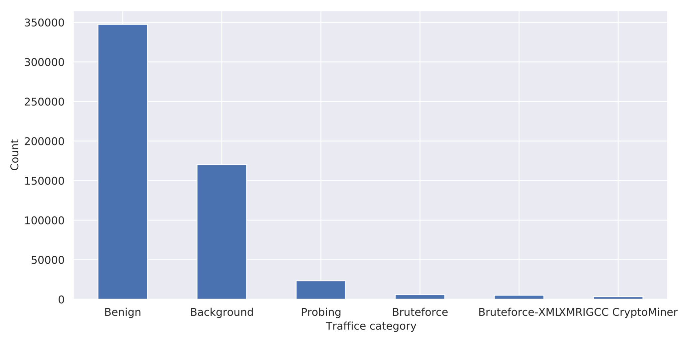
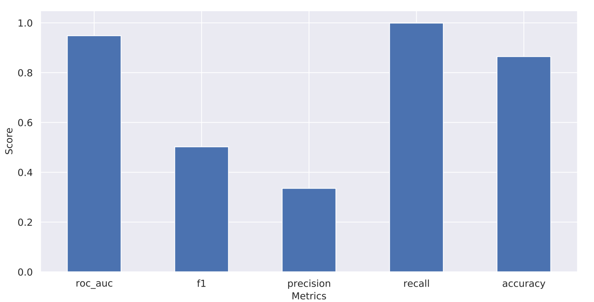
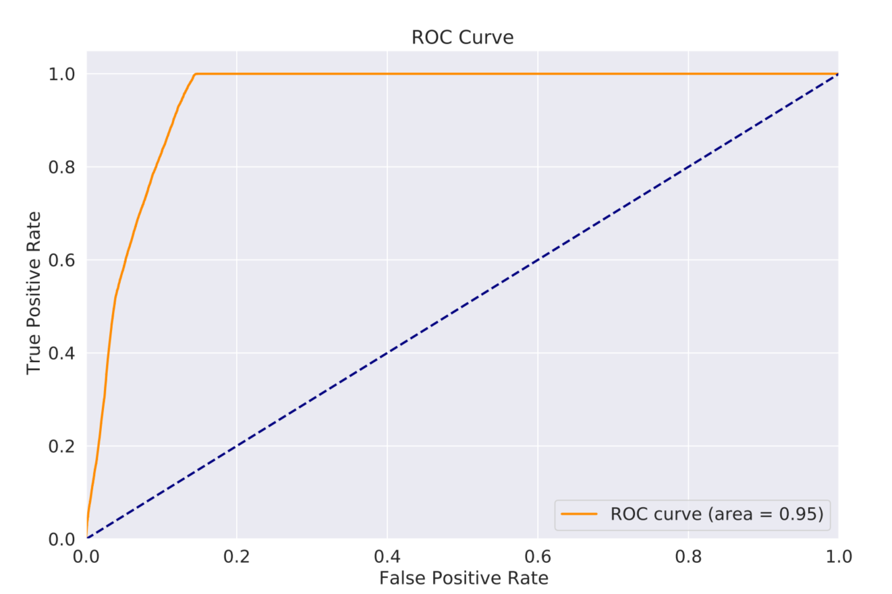
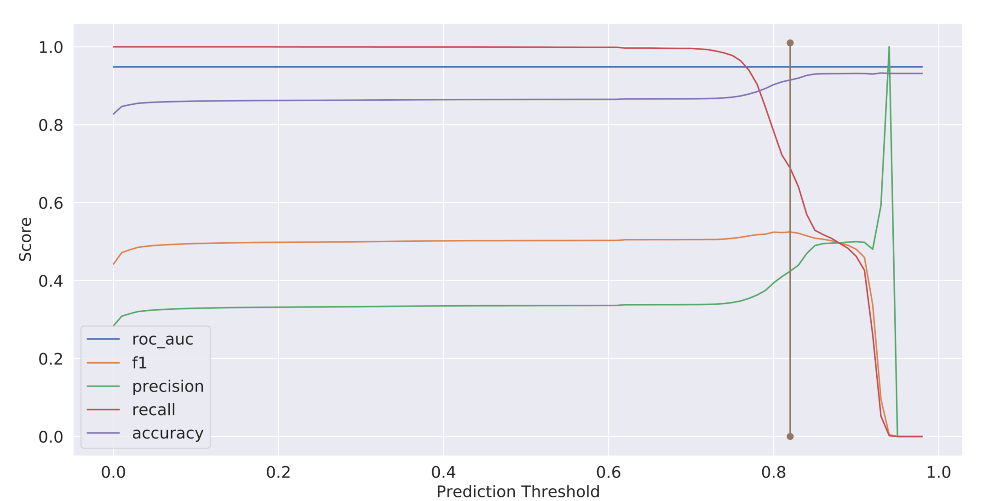
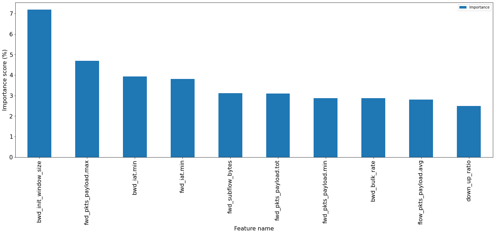

# IDS-on-HIKARI-2021

This project uses machine learning techniques for intrusion detection on the **HIKARI-2021** dataset  [[1]](#Ferriyan). This is the **state-of-the-art network detection dataset**, however the experimentation setup followed by the authors [[1]](#Ferriyan) to evaluate the detection performance is flawed. This limitation is similar to what [[2]](#Islam) found in prior works when implementing NIDS systems using machine learning models.

In this work we address those limitations and follow standard practices to improve the existing results. Our experiments show that the finally selected LGBMClassifier can significantly outperform the state-of-the-art model in terms of f1-score, precision, recall and is more usable for deployment in practice.

## Dataset

HIKARI-2021 dataset. Publicly available [here](https://zenodo.org/record/6463389#.YmDNCoXMJPY). Details about the dataset generation can be found from the original paper [[1]](#Ferriyan). The different traffic category count in the dataset is plotted in figure 

## Models

* LogisticRegression
* DecisionTreeClassifier
* RandomForestClassifier
* GaussianNB
* XGBClassifier
* LGBMClassifier

## Evaluation Metrics

* ROC-AUC
* Accuracy
* Precision
* Recall
* F1-score

## Experimental Setup

### Train-test split

Total dataset is split in 80:20 ratio to evaluate the state-of-the-art setup.

## Ten-fold cross validation

Used on the rest of the experiments on the train data. Then the best selected classifier is evaluated on the separate 20% test data.

## Test results

Final evaluation result of the best LGBMClassifier model uses estimators from each fold of the cross valiadtion to predict on the test set. Then takes the average prediction performance across all those folds to report the final test result.

|Prediction | Threshold  | auc |  f1  | precision  | recall |  accuracy |
|:---:|:---:|:---:|:---:|:---:|:---:|:---:|
0.50 | 0.948| 0.502| 0.335| 0.999 |0.864
0.82 |0.948| 0.523| 0.410| 0.722| 0.910

The default prediction is also shown in the figure 

### The ROC-AUC curve

### Effect of changing prediction threshold

### Top ten feature importance

## Reproducing steps

* Upload the [HIKARI_2021-Notebook](HIKARI_2021.ipynb) on colab. Or you may also use you local environment if you already have the libraries installed.
* Download the dataset from [here](https://zenodo.org/record/6463389#.YmDNCoXMJPY) and reference the file path in the notebook. If you are using Google colab, give access to your drive and move into the folder where you have uploaded this file.
* Run different sections of the notebook to reproduce the results.

## References

<a id="Ferriyan"> [1] </a>
Ferriyan, A., Thamrin, A. H., Takeda, K., and Murai, J. (2021). Generating network intrusion detection
dataset based on real and encrypted synthetic attack traffic. Applied Sciences, 11(17):7868.
8

<a id="Islam"> [2] </a>
Islam, M. K., Hridi, P., Hossain, M. S., and Narman, H. S. (2020). Network anomaly detection using
lightgbm: A gradient boosting classifier. In 2020 30th International Telecommunication Networks
and Applications Conference (ITNAC), pages 1–7. IEEE.